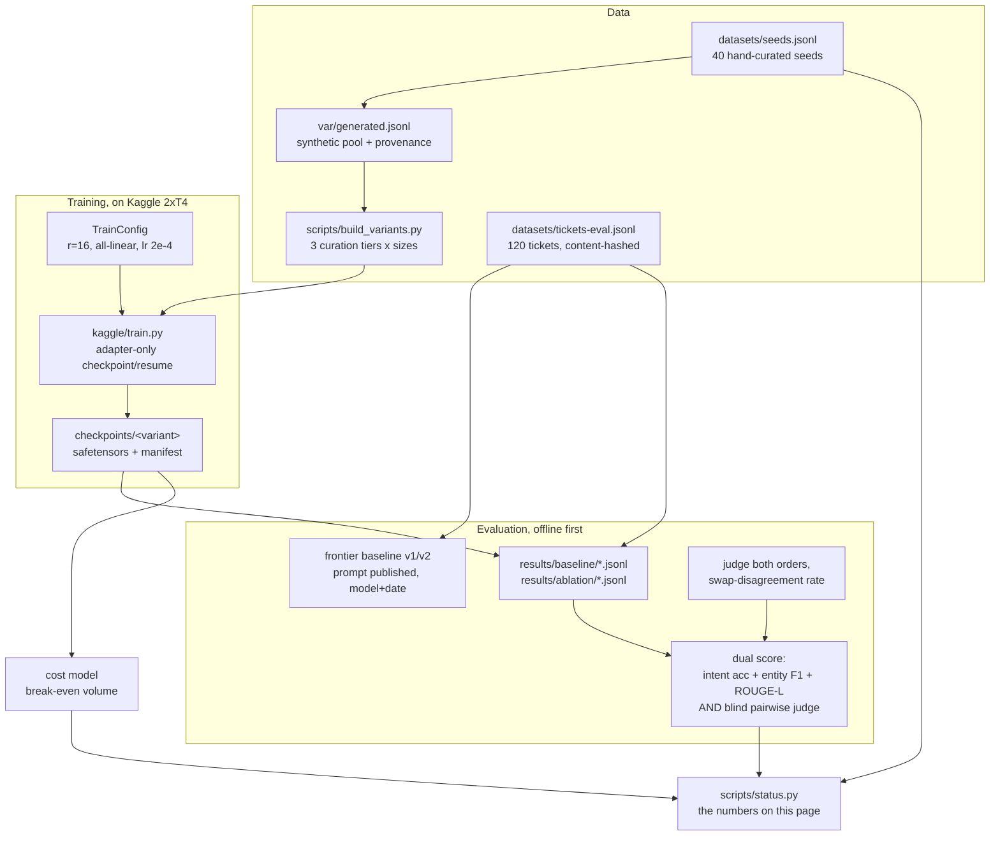

# Nishana

A QLoRA fine-tune on one narrow task, and the measurement discipline to prove
whether it actually helped.

The task: code-mixed Hinglish support-ticket intent classification and entity
extraction. The comparison: the same held-out tickets scored against a frontier
API with a published prompt, on both a distribution-similarity metric and a
blind judged-quality metric. The point is not "fine-tuning works". The point is
measuring when it helps, and catching the documented failure mode where it
silently makes a model worse while making its metrics look better.

Part of an eleven-project portfolio. Evaluated against ShipGate's adopting
contract, served behind Tollgate as a specialist route.

[Decisions](DECISIONS.md) · [Kaggle session protocol](kaggle/SESSIONS.md)

## Problem

Two claims dominate fine-tuning content online, and both are broken.

First: "a small fine-tuned model beats GPT-4." Usually measured with one prompt
attempt for the baseline and a test set the fine-tune never saw but its data
came from. LoRA Land (arXiv 2405.00732) is the honest version of this result:
310 adapters, 31 tasks, 4-bit LoRA beating base models by 34 points on average,
with the gap largest on language tasks and smallest on STEM.

Second, quieter and more dangerous: similarity metrics rise after fine-tuning
even when output quality falls. Fine-Tuning a 7B Advisor on Free-Tier GPUs
(arXiv 2504.15610) ran exactly this hardware profile, free-tier GPUs on
synthetic data, and watched BERTScore go up 0.063 while blind judges preferred
the un-fine-tuned model twice as often and the fine-tune invented four factual
errors the base model did not. Training on unverified synthetic data made the
model worse in ways its own training metric could not see.

This repo exists to reproduce that inversion check on one narrow task, with
every number regenerable from committed artifacts.

## Architecture



**Data.** The eval set is 120 hand-written support tickets, balanced at 30 per
intent across order_status, refund, account, and other, sliced by language
register (English, Hindi Devanagari, Latin-script Hinglish) and length.
Entities carry types (order_id, amount, date, product, phone) and every gold
value appears verbatim in its ticket text, which the test suite checks line by
line. The dataset is content-hashed; editing any field moves the hash and
invalidates old baselines by design.

**Contamination control.** `scripts/decontaminate.py` measures n-gram overlap
between the synthetic seed pool and the eval set at 5-gram and 8-gram length
and writes results/decontam.json. The current measured state:

| check | shared n-grams | eval items affected | overlap |
|---|---|---|---|
| 5-gram | 0 | 0/120 | 0.00% |
| 8-gram | 0 | 0/120 | 0.00% |

Regenerate with `make decontam`. The tokenizer keeps Devanagari words whole so
Hindi and Hinglish are compared under the same rules.

**Curation ablation.** Three training variants come from one seed pool:
`synthetic-only` (no human pass), `mixed` (verified rows plus an equal number
of unverified ones), and `verified-heavy` (hand-curated seeds plus verified
generated rows). Sizes of 250, 500, 1000, and 2000 bracket the published
500-to-2000 sweet spot. Every row carries its source and verification flag, so
any trained checkpoint can name exactly what went into it.

**Training.** Unsloth QLoRA on Kaggle's free 2xT4: rank 16 across all linear
layers, alpha 32, lr 2e-4, three epochs, following the Unsloth recipe that
consistently beats attention-only LoRA configs. Checkpoints are adapter-only
by design, because Kaggle kills sessions without warning and the next session
may land on different hardware. The manifest binds every checkpoint to its
base model, revision, rank, variant, and dataset hash, and resume refuses any
mismatch loudly. Optimizer state does not transfer between sessions; the loss
jump at each boundary is printed, not smoothed over. Protocol and run log:
[kaggle/SESSIONS.md](kaggle/SESSIONS.md).

**Scoring, dual by construction.** Every variant gets intent accuracy, entity
F1, and ROUGE-L similarity against a canonical reference rendering, and
separately a blind judged quality score: a judge sees the ticket and two
anonymous answers labelled A and B, never which variant produced what. Every
pair runs twice with candidates swapped across slots; only consistent winners
count and the swap-disagreement rate publishes beside the score, because a
preference number without its position-bias number invites the exact trust the
bias undermines.

**Frontier baseline fairness.** Two prompts are published in full in
nishana/eval/frontier.py. v1 is deliberately minimal; v2 adds the exact JSON
schema, copy-exactly rules for entities, and a tie-break toward refund when
refund vocabulary rides inside a status question. Both stay scored: if they
land close together the task was prompt-insensitive; if they diverge, that gap
is part of what the fine-tune has to beat. Every baseline row records provider,
model string, and date.

## Benchmarks

Methodology first, then what exists today.

Every number in this section comes from a script reading committed artifacts.
Sections marked pending have no artifacts yet, because their runs need GPU
hours or API keys; nothing here estimates or extrapolates.

Measured now:

| claim | value | regenerate |
|---|---|---|
| 5-gram overlap, seeds vs eval | 0.00% (0/120 items) | `make decontam` |
| 8-gram overlap, seeds vs eval | 0.00% (0/120 items) | `make decontam` |
| eval set integrity | 120 items, all slices >= 10, entity values verbatim | `uv run pytest tests/data/test_evalset.py` |

Pending first training run (commands ready, artifacts absent):

| claim | will be regenerated by |
|---|---|
| adapter vs frontier on intent accuracy, >= 3 runs with spread | `make train-eval` |
| blind judged quality + swap-disagreement rate per pair | `scripts/judge_quality.py` |
| fidelity-vs-quality inversion finding | `scripts/train_eval.py`, column gap |
| cost table + break-even volume | `scripts/cost_table.py --seconds-per-step <measured>` |

Literature anchors for sanity, not substitutes for measurement: LoRA Land
reports 4-bit LoRA within about 2 percent of full fine-tuning and under $8 per
adapter; arXiv 2504.15610 reports peak memory of 15.9 GB then 14.7 GB across
its two free-tier sessions, inside our budget profile. When our numbers exist
they stand next to these, dated.

### The slice where the frontier still wins

Pre-registered before any run: the frontier model should hold its lead on the
ambiguous `other` slice, where intent boundaries blur into general questions
(tkt-091 through tkt-120), and on tickets whose phrasing mixes two intents
(tkt-017, tkt-021, tkt-025). A fine-tune learns the label distribution of its
training data; ambiguity resolution against open-ended questions is where
distribution learning helps least. When results land, this section names the
losing slices in the headline whether or not the prediction holds. If the
fine-tune wins everywhere including here, that is exactly the kind of result
that should be double-checked for contamination before it is believed, which is
what the decontamination table above is for.

### Cost shape

From deploy/pricing.yaml, verified 2026-08-24: training on Kaggle costs $0 in
currency and 30 quota-hours a week; serving on Modal T4 at scale-to-zero bills
per second active plus cold starts; the break-even solver compares self-hosted
per-1k cost against frontier list price with token counts measured from real
baseline predictions once they exist. With free-tier training there is no fixed
cost to recover, so the interesting figure is savings per 1k and how far $30 of
Modal credits stretch. Run `uv run python scripts/cost_table.py --seconds-per-step <measured>`.

## What Broke

**The contamination check cried wolf on its first run.** The first version of
the tokenizer used `\w+`, which splits Devanagari words at combining vowel
signs, so कृपया became क + पय and ऑर्डर became ऑर + डर. Under that scheme the
politeness frame around every Hindi ticket looked like shared 5-grams, and the
tool reported 1 of 120 eval items contaminated (0.83%) against tkt-019. After
fixing the pattern to keep Indic scripts whole, the same check reports zero
shared 5-grams and zero shared 8-grams. The false positive was harmless here
and instructive everywhere else: a decontamination tool with broken tokenization
manufactures both false alarms and false all-clears, and only publishing the
offender ids made the bug visible.

**Windows consoles cannot print Devanagari.** Inspecting the offender list
above crashed with cp1252 encoding errors before printing a single id. Every
script now reconfigures stdout to UTF-8 on startup, which is why the offender
inspection worked at all.

## Technical Decisions

Full log in [DECISIONS.md](DECISIONS.md). The four that shaped the build:

**Adapter-only resume, optimizer state dropped.** Kaggle sessions die mid-run;
the precedent paper carried just the adapter across two different GPUs. The
loss discontinuity at each boundary is logged rather than hidden.

**Blind means blind.** Variant identity never enters the judge prompt, slot
order comes from a hash of the item id, and every pair is judged in both
orders. ShipGate's calibration work showed a judge can be perfectly consistent
and still wrong; the swap-disagreement rate keeps that failure mode visible.

**Similarity never travels alone.** Every variant score carries a blind
judged-quality column or prints null. A similarity number by itself is the
exact instrument that made unverified synthetic data look like progress.

**No FastAPI service in this repo.** Serving is a contract (ShipGate adopting
shape) plus deploy/modal_serve.py on Modal, not a Render web service. The
chassis's app/ scaffolding was removed rather than kept warm.

## Run It

Requires [uv](https://docs.astral.sh/uv/). No API keys needed for anything
offline.

```bash
uv sync

# verify the harness end to end (102 tests)
uv run pytest && uv run ruff check .

# measure and publish seed-vs-eval contamination
make decontam          # add APPLY=1 to drop overlapping items and re-hash

# print the status numbers (what this README's tables show)
make bench

# full pipeline, needs keys: baseline via Groq/Gemini, then scoring
cp .env.example .env   # add keys, set LLM_PROVIDER
uv run python scripts/run_baseline.py --mode frontier --provider groq
uv run python scripts/judge_quality.py --left ... --right ...
```

Training happens on Kaggle, not here. The cell-level instructions, session
budgeting, and resume protocol are in [kaggle/SESSIONS.md](kaggle/SESSIONS.md).

Gating through ShipGate takes the two files already in this repo
(`shipgate.yaml`, `.github/workflows/eval.yml`) plus three secrets; see
ShipGate's docs/ADOPTING.md.

## Scope

Not a general fine-tuning framework, not a hyperparameter search tool, and not
a hosting platform. One task, one honest comparison, one ablation done
properly. It does not claim fine-tuning is better than prompting; it measures
where each wins and publishes the boundary.
